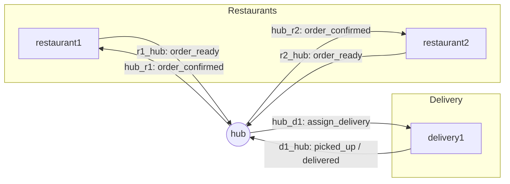
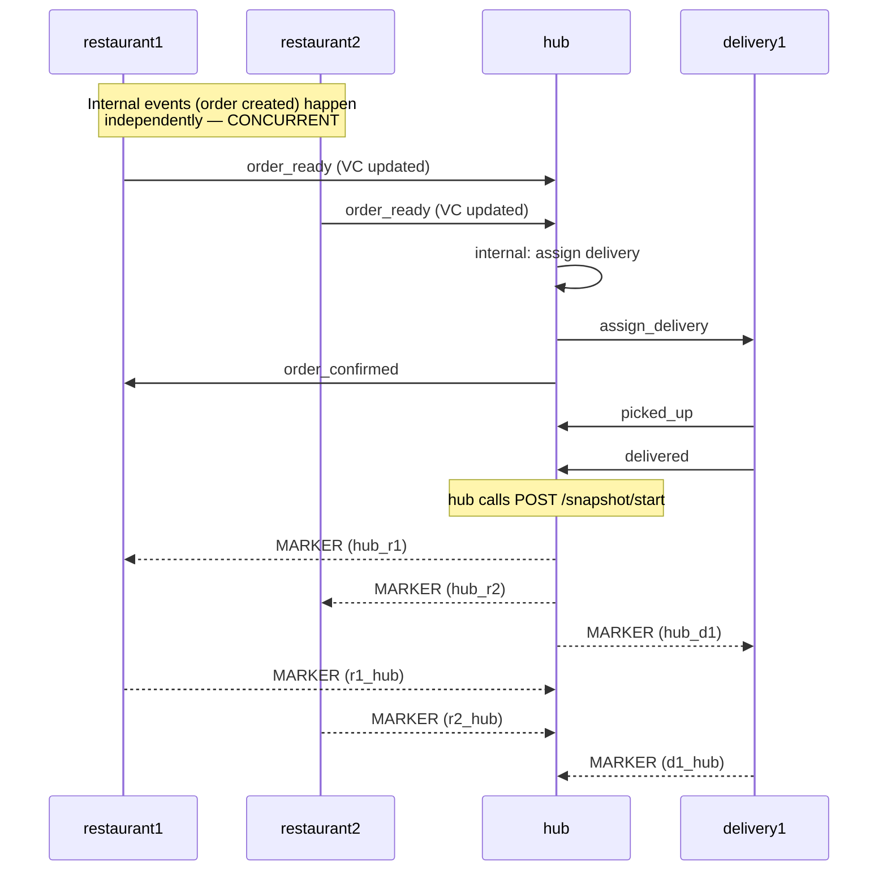

# Technical Plan: Distributed Food Delivery Monitor

## Architecture Diagram

Each box is an independent Flask process (own container, own memory, own
Vector Clock). Arrows are the 6 explicit channels defined in `spec.md`.

## Event / Snapshot Flow


## Module Layout
```
dc-lab/
├── common/
│   ├── vector_clock.py   # VectorClock class + compare()
│   └── channels.py       # static topology, ports, auth tokens
├── app.py                # single generic Flask app (role via PROCESS_NAME)
├── demo.py               # host-side orchestration + concurrency/snapshot demo
├── Dockerfile
├── docker-compose.yml
├── requirements.txt
└── specs/ .specify/      # this SDD documentation
```

## Key Design Decisions
1. **One image, four roles.** `PROCESS_NAME` env var selects behavior inside
   `app.py`. Keeps restaurant1/restaurant2 guaranteed identical in logic.
2. **FIFO enforced via per-send lock**, not by relying on HTTP/TCP alone —
   documented as an explicit assumption required by Chandy-Lamport.
3. **Generic Chandy-Lamport engine** implemented once (`initiate_snapshot`,
   `receive_marker`, `on_receive_message` hook) and reused identically by
   every process — only the channel topology differs per process, and that's
   derived automatically from `common/channels.py`.
4. **In-memory only.** `state`, `vc.clock`, and `snapshot` are plain Python
   dicts guarded by `threading.Lock`. Restarting a container wipes it — this
   is a deliberate simplification, not an oversight (see constitution §2.2).
5. **Consistency argument (for the report):** because every process records
   its local state exactly once (on first marker or on initiating), and
   records exactly the messages sent by the *other* process before that
   process's own snapshot but not yet received — the cut is a valid
   Chandy-Lamport consistent cut. No message is "received but never sent"
   in the reconstructed global state, and no message is "sent but lost"
   for the channels being recorded, by construction of the algorithm.

## Testing Strategy
- Unit-level: exercise `VectorClock.tick/merge/compare` directly with
  `python -c` sanity checks (no Flask needed).
- Integration: run all 4 processes locally (`USE_DOCKER=false`, distinct
  ports) via `demo.py`, which drives the full order lifecycle, prints every
  process's vector clock log, explicitly compares the two `order_ready`
  send events from restaurant1/restaurant2 (expected: `concurrent`), then
  triggers `/snapshot/start` on `hub` and prints the assembled global
  snapshot from all 4 `/snapshot/state` endpoints.
- Docker: `docker compose up --build` runs the same 4 processes as separate
  containers on a bridge network; `demo.py --docker` reruns the same script
  against the mapped host ports.
